# impulse EDA Playground

A comprehensive playground showcasing impulse's capabilities for EDA waveform analysis and protocol verification. This workspace includes realistic waveforms, TLM transactions, and pinlevel protocol analysis from industry-standard formats (VCD, FST, FSDB) along with specialized transaction logs.

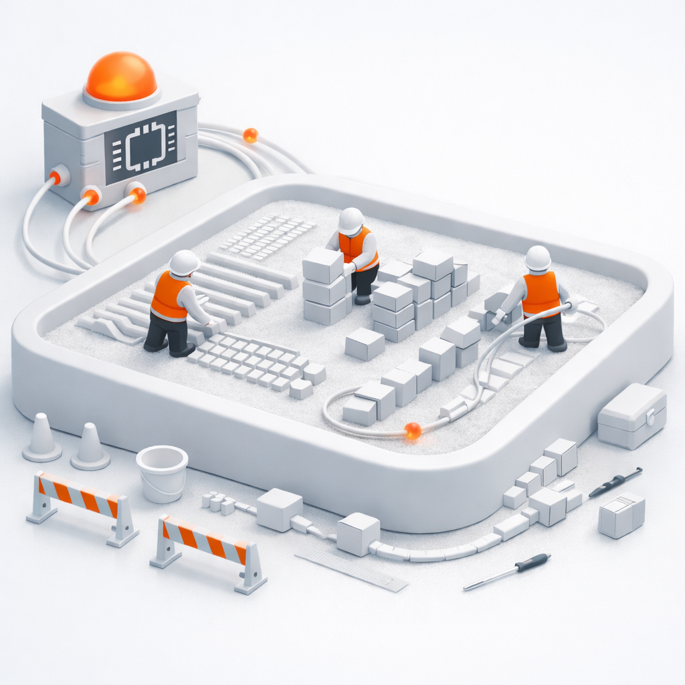

## Introduction to impulse

impulse is a visualization and analysis workbench for signals from logs, traces, and simulations. It helps you inspect large datasets efficiently and tailor presentations for your workflow.

- Records: Hierarchical containers with scopes and elements (signals, includes, analysis, interfaces).  
- Signals: Sequences of samples along a domain (typically time). Supported types include logic, float, integer, enum/event, text, array, struct, and binary.  
- Views: Reusable presentations that combine signals, folders, and diagrams (line, gantt, event, charts). Views support multiple axes and cursors. Processing is on demand—only visible parts are computed, and collapsed folders don't trigger processing.  
- Processing & automation: Readers/producers build records; processors and expressions derive or filter signals; value formats and labels control textual rendering.

## What's Here

- **1 waveforms**: Industry-standard waveform formats (VCD, FST, FSDB) from RTL simulations with hierarchical scopes and diverse signal types.
- **2 tlm transactions**: Transaction-level modeling (TLM) records showcasing AXI, ACE, CHI protocol analysis with SystemC transactions.
- **3 pinlevel transactions**: Pin-level protocol analysis combining waveforms with protocol analyzers for AXI4, ACE, and CHI interfaces.

## Formats at a Glance

- **VCD** (Value Change Dump): Industry-standard ASCII waveform format from Verilog/SystemVerilog simulations.
- **FST** (Fast Signal Trace): Compressed binary format from GTKWave, optimized for large waveforms with fast random access.
- **FSDB** (Fast Signal Database): Verdi/proprietary format from Synopsys tools, widely used in ASIC verification. **Note:** Requires valid Synopsys license and FSDB reader library (ffrAPI). See the impulse help system (search for "FSDB Native Reader") for setup instructions.
- **recMz/recMl**: impulse compressed/XML record formats containing TLM transaction data with relations and timing.
- **recJx**: Expression-based records generated on-the-fly via impulse scripts.
- **txlog/scv/ftr**: Transaction log formats from verification environments (TLM, SystemC, protocol monitors).

## Quick Start

1) Open any sample file in impulse.
2) Click **Open Views** and pick a matching starter view (see below).
3) Need help? See the impulse manual for guided tours, feature deep-dives, and troubleshooting: [toem.io/category/resources/impulse-manual/](https://toem.io/category/resources/impulse-manual/). Recommended sections: Introduction, impulse at a Glance, and Views.

## Hints

0. **First Startup**: When first time opening impulse, it may take a few seconds to startup the impulse server, especially if you use a slower or loaded external server.

1. **License Dialog**: When opening a view for the first time, you may encounter a license dialog. During the BETA phase, this dialog informs you about the beta status and licensing information. Simply acknowledge the dialog to proceed with exploring the playground samples.

2. **View Selection**: When opening a record, impulse tries to find the best view based on the signals referred to. You can see this judgment in the view selection dialog (Good, Weak, Bad). In some cases, impulse does not find the correct view automatically but opens the view selection dialog for you to select.

3. **Reader Configuration**: In some cases, you may need to choose a reader configuration to add additional analysis or other record elements if you find something missing in the view.

## Advanced Features Demonstrated

### Protocol Analysis
- **Automated transaction extraction**: ACE, AXI4, CHI analyzers reconstruct high-level transactions from pin-level signals
- **Multi-protocol support**: View different protocol layers (TLM base protocol → AXI → ACE/CHI) simultaneously
- **Relation tracking**: Visualize request-response relationships and transaction dependencies

### Waveform Formats
- **Universal format support**: VCD, FST, FSDB, and impulse native formats
- **Optimized loading**: Fast random access to compressed waveforms
- **Hierarchical navigation**: Deep scope trees with thousands of signals

### Analysis Capabilities
- **Expression filtering**: Filter transactions by protocol fields (e.g., exclude specific commands)
- **Statistics extraction**: Bandwidth, latency (min/max/median), pending counts
- **Charts and metrics**: Bar/pie charts for distribution analysis and bandwidth visualization
- **Dual cursors/axes**: Measure timing differences and compare multiple metrics

### Verification Features
- **Pin-to-TLM correlation**: Bridge pin-level waveforms with transaction-level analysis
- **Protocol compliance**: Automated checks via protocol analyzers
- **Coverage analysis**: Transaction distribution and field value coverage
- **Debug workflows**: Trace protocol violations back to pin-level activity

## Prepared Views by Folder

All views include dual cursors (A, B) and dual axes (Primary, Secondary).

### 1 waveforms

Industry-standard digital waveform formats from RTL simulations demonstrating hierarchical navigation, signal grouping, and value analysis.

**[→ See detailed overview](1%20waveforms/OVERVIEW.md)**

> **FSDB Prerequisites:** To open FSDB files (3_verilog.fsdb), you need:
> - Valid Synopsys VCS or equivalent license
> - FSDB reader library (ffrAPI) installed
> - Native reader built and configured in impulse
> 
> See the impulse help system (search for "FSDB Native Reader") for detailed setup instructions. VCD and FST samples work without additional prerequisites.

---

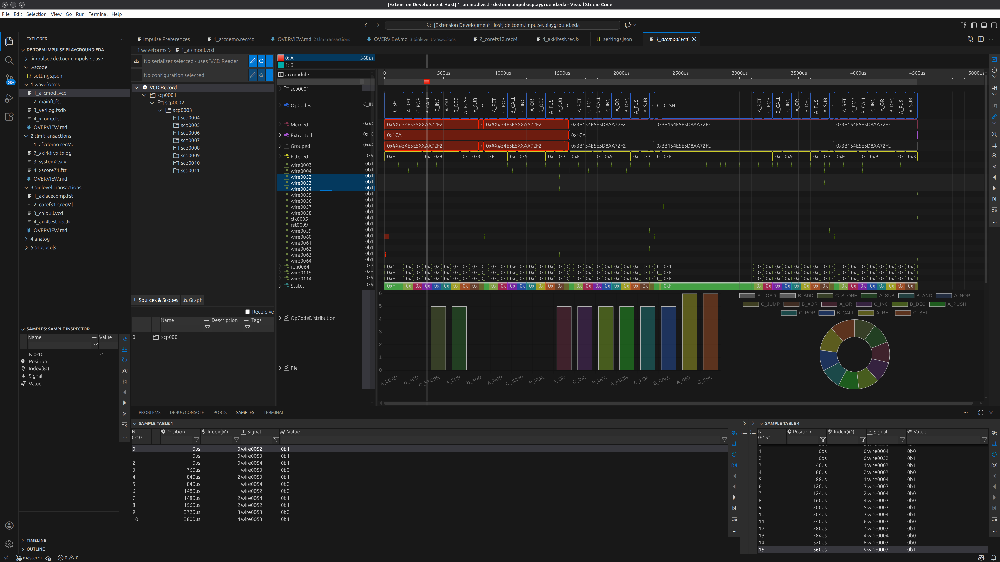

**[1_arcmodl.vcd](1%20waveforms/1_arcmodl.vcd)** → View: **arcmodule**
- Deep hierarchy navigation (nested scopes) • Multiple signal types (parameters, wires, registers, tri-state) • Folder organization • Logic signal visualization • Chart analysis (bar/pie) for opcode distribution • Expression-based metrics

---

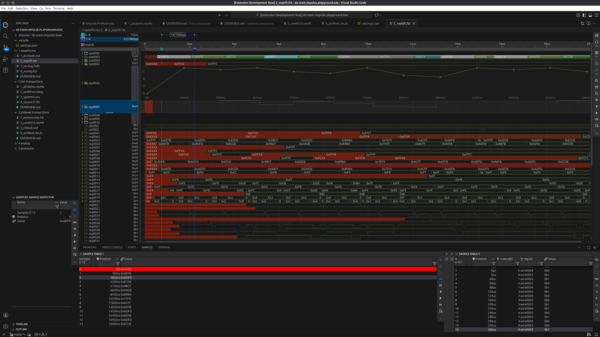

**[2_mainft.fst](1%20waveforms/2_mainft.fst)** → View: **mainft**
- Fast Signal Trace (FST) compressed format • Hierarchical scope browsing • Register analysis • Dual cursor/axis support • Efficient large-waveform handling

---

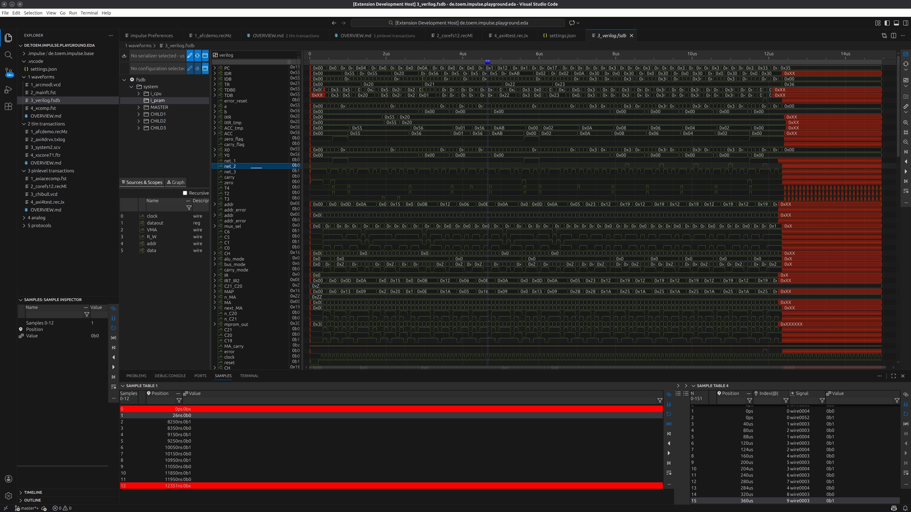

**[3_verilog.fsdb](1%20waveforms/3_verilog.fsdb)** → View: **verilog**
- FSDB format (Synopsys/Verdi) • CPU internals (PC, ALU, registers) • Control flow analysis • Flag tracking (zero, carry) • System-level hierarchies (PCU, ALUB modules)

---

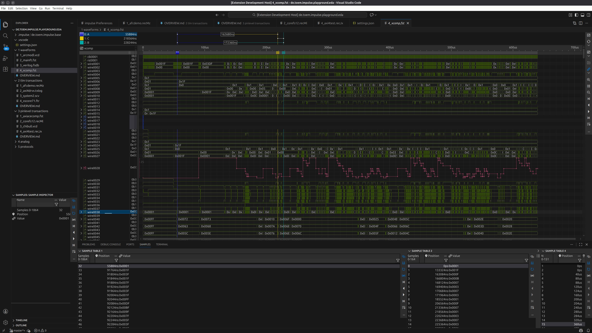

**[4_xcomp.fst](1%20waveforms/4_xcomp.fst)** → View: **xcomp**
- Clock/reset analysis • Wire/register correlation • Control signal inspection • Mixed signal types

### 2 tlm transactions

Transaction-Level Modeling records from SystemC verification environments showcasing protocol analysis with timing, relations, and bandwidth metrics.

**[→ See detailed overview](2%20tlm%20transactions/OVERVIEW.md)**

---

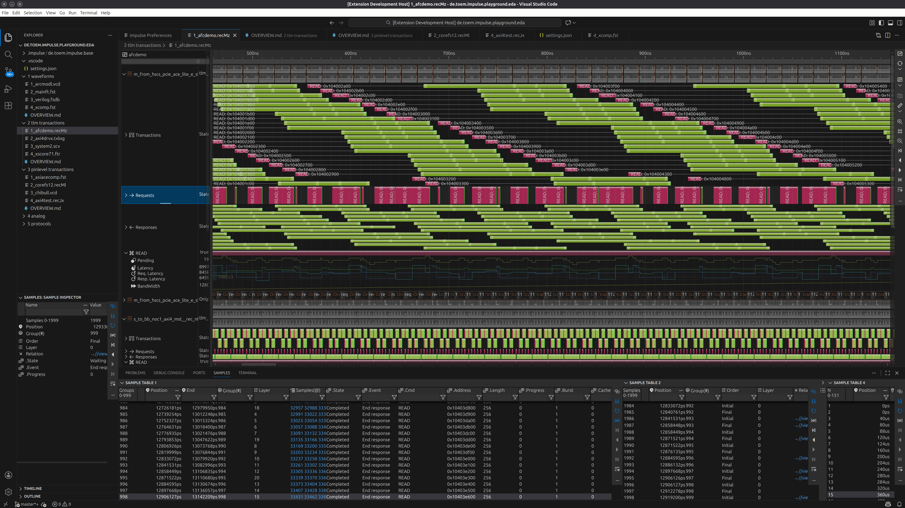

**[1_afcdemo.recMz](2%20tlm%20transactions/1_afcdemo.recMz)** → View: **afcdemo**
- TLM AXI/ACE-Lite transactions • Non-blocking (nb) and timed variants • PCIe bridge analysis • Transaction relations • Multiple socket monitoring

---

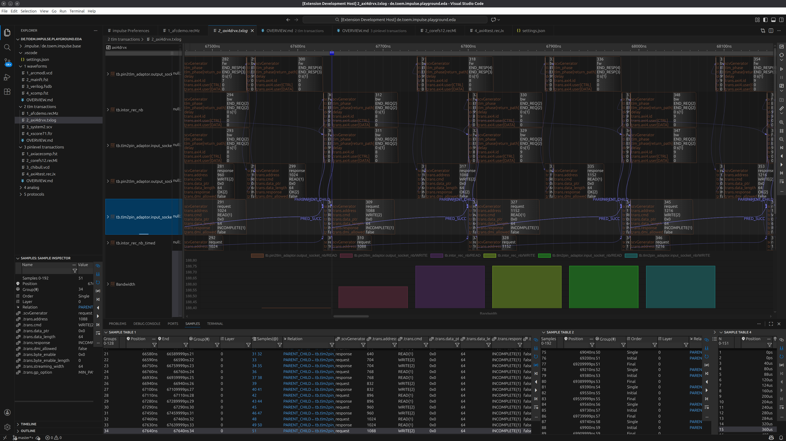

**[2_axi4drvx.txlog](2%20tlm%20transactions/2_axi4drvx.txlog)** → View: **axi4drvx**
- Pin-to-TLM and TLM-to-pin adaptor analysis • Base protocol transactions • AXI protocol layer • Transaction relations visualization • Timed vs. untimed transaction comparison • Bandwidth charts with legends

---

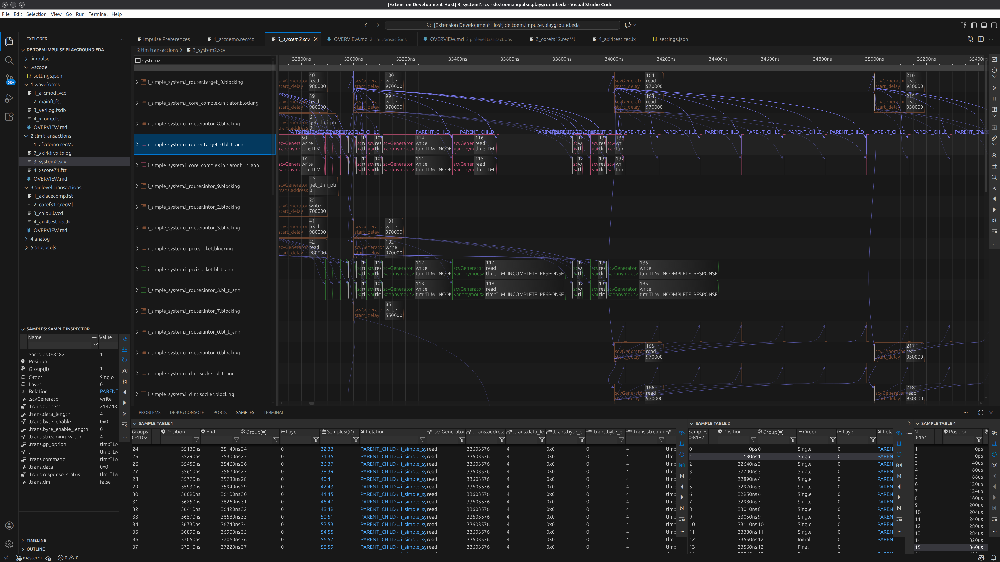

**[3_system2.scv](2%20tlm%20transactions/3_system2.scv)** → View: **system2**
- SystemC verification (SCV) format • Router/core complex interaction • Blocking transactions • Initiator/target analysis • Transaction relations

---

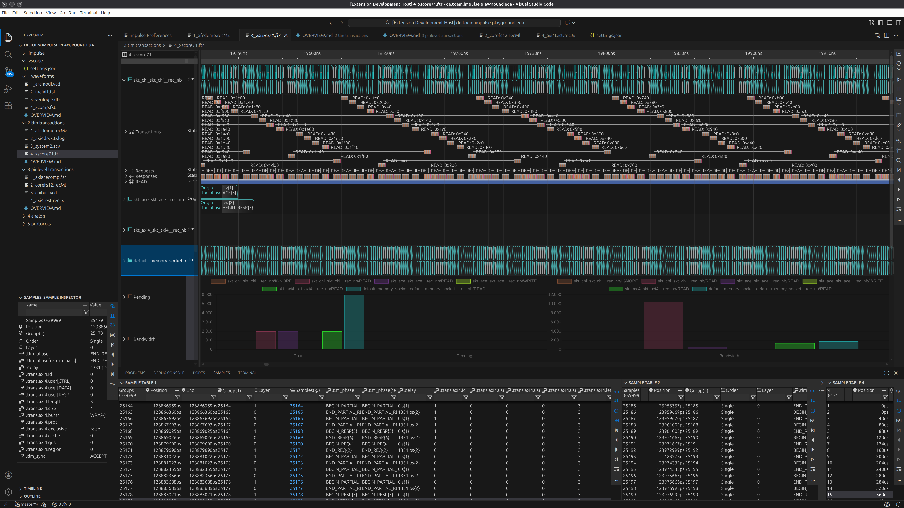

**[4_xscore71.ftr](2%20tlm%20transactions/4_xscore71.ftr)** → View: **4_xscore71**
- Multi-protocol analysis (CHI, ACE, AXI4) • Expression filtering (excluding cmd=1) • Transaction statistics (count, pending) • Bandwidth analysis • Memory socket monitoring • Bar charts with multiple members

### 3 pinlevel transactions

Pin-level waveforms combined with protocol analyzers to extract high-level transaction views from raw signal activity.

**[→ See detailed overview](3%20pinlevel%20transactions/OVERVIEW.md)**

---

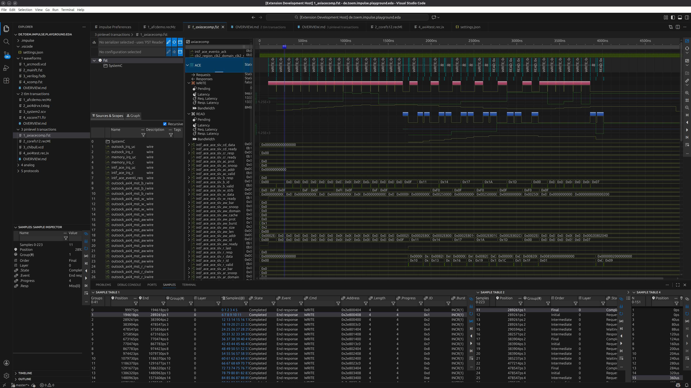

**[1_axiacecomp.fst](3%20pinlevel%20transactions/1_axiacecomp.fst)** → View: **axiacecomp**
- ACE protocol analyzer • Pin-level to transaction extraction • Clock domain analysis • Event signals (ack/req) • Automated transaction reconstruction from waveforms

---

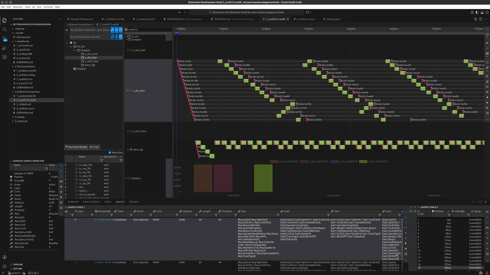

**[2_corefs12.recMl](3%20pinlevel%20transactions/2_corefs12.recMl)** → View: **corefs12**
- ACE interface analysis • RTL wrapper inspection • AXI channels (AW/W/B/AR/R) • Protocol field breakdown (ID, address, size, burst, cache, protection) • Latency statistics (min/max/median) • Bar charts for latency analysis

---

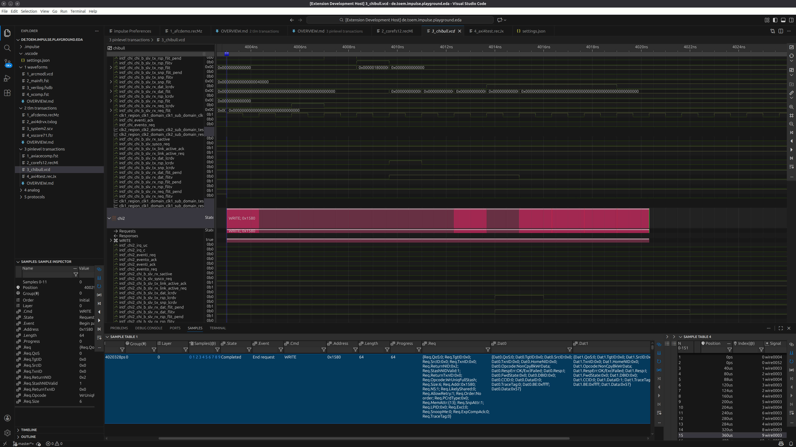

**[3_chibull.vcd](3%20pinlevel%20transactions/3_chibull.vcd)** → View: **chibull**
- CHI (Coherent Hub Interface) protocol analyzer • Link management signals • Flit-level analysis (request/response/data) • System coherency tracking • IRQ monitoring • Multiple CHI domains

---

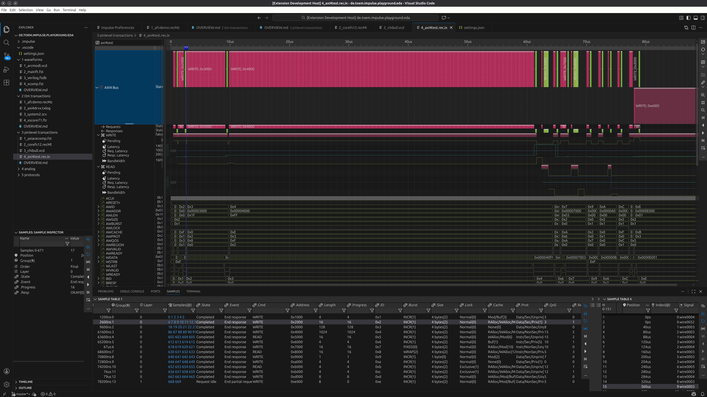

**[4_axi4test.recJx](3%20pinlevel%20transactions/4_axi4test.recJx)** → View: **axi4test**
- AXI4 protocol analyzer • Complete AXI4 bus signals (AW/W/B/AR/R channels) • QoS and region support • Lock/cache/protection attributes • Clock/reset monitoring • Comprehensive protocol compliance verification

---

**Explore more impulse features at [toem.io](https://toem.io)**
